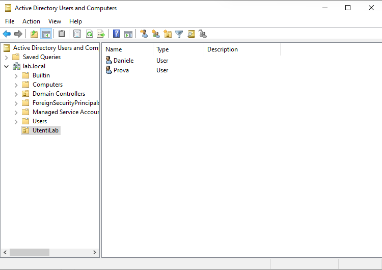

Perfetto Daniele, ti scrivo qui l’intero contenuto del file `README.md` in **stile bilingue** come hai richiesto, così puoi copiarlo direttamente.

---

# 🧱 Windows Server 2022 – Active Directory & DNS Setup (Proxmox Lab)

Complete setup of a Windows Server 2022 domain controller in my home Proxmox lab. The server is promoted to a Domain Controller with a new forest (`lab.local`), internal DNS service, and user management via Active Directory.

---

## 🖼️ Reference Images

* Promotion to Domain Controller
  

* nslookup showing domain resolution
  

* OU and users created in Active Directory
  

* Snapshot creation after full configuration
  

---

## 📚 Language / Lingua

* 🇬🇧 [English version](#english-version)
* 🇮🇹 [Versione italiana](#versione-italiana)

---

## 🇬🇧 English Version

### 1. Objective

Promote a Windows Server 2022 VM to a Domain Controller in a local lab using Proxmox. Install and configure:

* Active Directory Domain Services (AD DS)
* DNS Server
* Create users and OU
* Snapshot the configured environment

---

### 2. Requirements

* A working Windows Server 2022 VM with VirtIO drivers and guest agent
* Static IP configured (recommended)
* Server Manager access

---

### 3. Install AD DS Role

* Open Server Manager → Manage → Add Roles and Features
* Select:

  * Role-based installation
  * Active Directory Domain Services (add required features)
* Proceed to install without reboot

---

### 4. Promote to Domain Controller

* Post-install banner → “Promote this server to a domain controller”
* Choose: Add a new forest → Domain name: `lab.local`
* Set DSRM password
* Accept default options and install
* Server reboots automatically

---

### 5. Verify DNS

Open CMD and run:

```bash
nslookup
lab.local
```

Expected result: resolution to internal server IP (e.g. `192.168.1.109`)

---

### 6. Create OU and Users

* Open **Active Directory Users and Computers**
* Right-click domain → New → Organizational Unit → Name: `UtentiLab`
* Inside it:

  * Create user `Daniele`
  * Create user `Prova`
  * Set passwords, disable "change at next login"

---

### 7. Take Snapshot (Proxmox)

* Name: `ad-lab-configurato`
* Description: Domain configured, users and DNS ready
* Disable RAM include
* Confirm snapshot

---

### 8. Notes

* Default DNS is localhost (::1), optionally replace with static IPv4 in network settings
* Users ready to login from domain-joined clients

---

### 9. Author

Created by **Sebastiano Daniele Condorelli**
LinkedIn: [linkedin.com/in/sebastianodanielecondorelli](https://www.linkedin.com/in/sebastianodanielecondorelli)
2025

---

## 🇮🇹 Versione italiana

### 1. Obiettivo

Promuovere una VM Windows Server 2022 a Domain Controller nel mio laboratorio locale su Proxmox. Installare e configurare:

* Active Directory Domain Services (AD DS)
* Server DNS
* Creazione utenti e OU
* Snapshot dell’ambiente configurato

---

### 2. Requisiti

* VM Windows Server 2022 funzionante, con driver VirtIO e guest agent
* IP statico consigliato
* Accesso a Server Manager

---

### 3. Installazione del ruolo AD DS

* Apri Server Manager → Manage → Add Roles and Features
* Seleziona:

  * Installazione basata su ruoli
  * Active Directory Domain Services (aggiungi funzionalità richieste)
* Installa senza riavvio

---

### 4. Promozione a Domain Controller

* Dopo installazione → “Promote this server to a domain controller”
* Scegli: Nuova foresta → Nome dominio: `lab.local`
* Inserisci password DSRM
* Accetta tutte le impostazioni e installa
* Riavvio automatico

---

### 5. Verifica DNS

Apri il prompt e digita:

```bash
nslookup
lab.local
```

Risultato atteso: risoluzione dell’IP interno (es: `192.168.1.109`)

---

### 6. Creazione OU e utenti

* Apri **Active Directory Users and Computers**
* Clic destro sul dominio → New → Organizational Unit → Nome: `UtentiLab`
* All’interno crea:

  * Utente `Daniele`
  * Utente `Prova`
  * Password settata, rimuovi “cambia al prossimo accesso”

---

### 7. Snapshot in Proxmox

* Nome: `ad-lab-configurato`
* Descrizione: Dominio configurato, utenti e DNS pronti
* Lascia disattivata “Include RAM”
* Salva snapshot

---

### 8. Note

* Il DNS di default è `::1`, puoi sostituirlo con IPv4 statico se preferisci
* Utenti pronti per il login da client uniti al dominio

---

### 9. Autore

Creato da **Sebastiano Daniele Condorelli**
LinkedIn: [linkedin.com/in/sebastianodanielecondorelli](https://www.linkedin.com/in/sebastianodanielecondorelli)
2025


